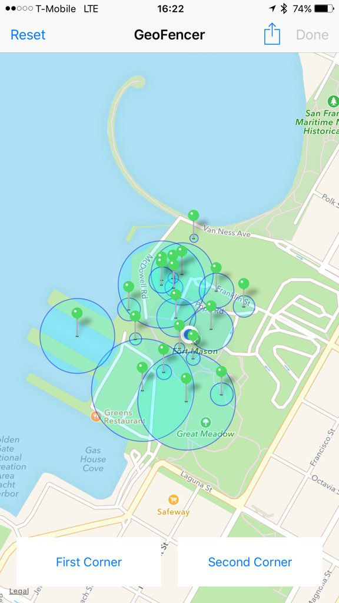

# GeoFencer

This is a simple iOS app designed for people creating location-based content.

It lets you manually define geofences by tagging physical points in the real world that you're currently standing at, using your phone's GPS. It then lets you export that data, in JSON, in a format that can be easily turned into iOS geofence regions.

## Setup

This assumes a functioning iOS development environment. It has not yet been tested on iOS 10.

1. Clone this repo

2. Open `GeoFencer.xcworkspace`

3. Run on-device

## Usage

Currently, this lets you generate circular regions (center point + radius) by geotagging two points along the edge of the circle. 

Tapping either the "first corner" or "second corner" button in the app will tag your current location. If either the first or second corner is already set, your current position will overwrite the existing one. If you've set both positions, you will be able to see the region circle; once you're happy with that, tapping the 'done' button will prompt you to set a name for the region.

You can tap any existing center pin to edit that region.

The share icon lets you export your data as JSON. It uses a standard iOS share sheet.

Data persists across app launches. The `Reset` button erases all data (it will confirm you want to do this, in case you mis-tap).

## Future Plans

This code is basically provided as-is. Maybe it'll be useful to you. Contributions are gladly accepted, although not particularly expected.

## Contact Info

[https://twitter.com/lazerwalker](@lazerwalker)

For questions about this code, please use GitHub Issues.

## License

This project is licensed under the MIT License. See the LICENSE file in this repo for more info.